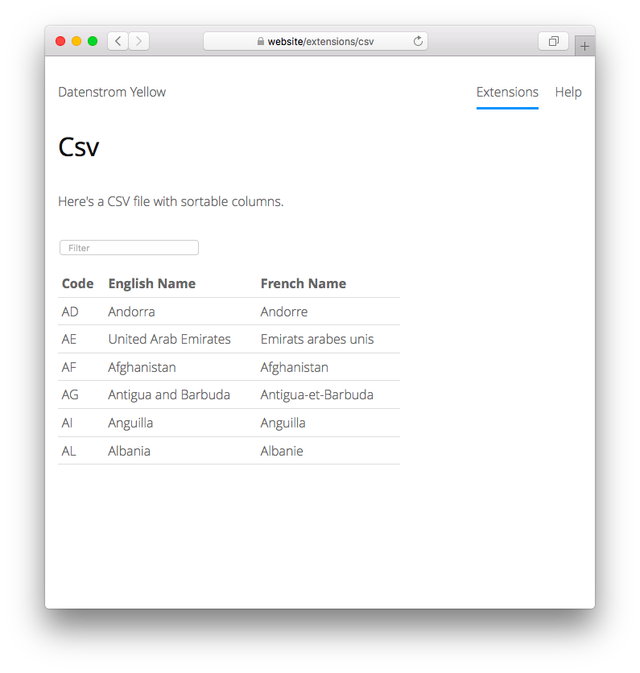

<p align="right"><a href="README-de.md">Deutsch</a> &nbsp; <a href="README.md">English</a></p>

# Table 0.9.1

Create tables from CSV data.

<p align="center"></p>

## How to install an extension

[Download ZIP file](https://github.com/schulle4u/yellow-table/archive/refs/heads/main.zip) and copy it into your `system/extensions` folder. [Learn more about extensions](https://github.com/annaesvensson/yellow-update).

## How to display a table file

Create a `[table]` shortcut. 

The following arguments are available, all but the first argument are optional:

`FileName` = name of the csv table file  
`RowsPerPage` = Number of rows for pagination  
`Class` = HTML table class  

This extension loads a table file in CSV format and outputs a HTML table. For large tables you can enable row filtering, column sorting, and pagination functions. You can also load table data as code block in Markdown. If you need even more functionality, [here is another extension](https://github.com/GiovanniSalmeri/yellow-table) under the same name, developed by Giovanni Salmeri. 

## Examples

Basic usage:

    [table tapes.csv]

Use custom class: 

    [table tapes.csv - MyTapes]

Use a Markdown code block to display table data: 

    ```table
    Code,English Name,French Name
    AD,Andorra,Andorre
    AE,United Arab Emirates,Emirats arabes unis
    AF,Afghanistan,Afghanistan
    AG,Antigua and Barbuda,Antigua-et-Barbuda
    AI,Anguilla,Anguilla
    AL,Albania,Albanie
    ```

## Settings

The following settings can be configured in file `system/extensions/yellow-system.ini`:

`TableDirectory` = directory for table files  
`TableDelimiter` = column delimiter, `auto` for automatic detection  
`TableFirstRowHeader` = use first line of table file as table header, 1 or 0  
`TableFunctions` = Enable row filtering, column sorting and pagination functions, 1 or 0  
`TableRowsPerPage` = Number of rows for pagination  

## Developer

Steffen Schultz. [Get help](https://datenstrom.se/yellow/help/).
